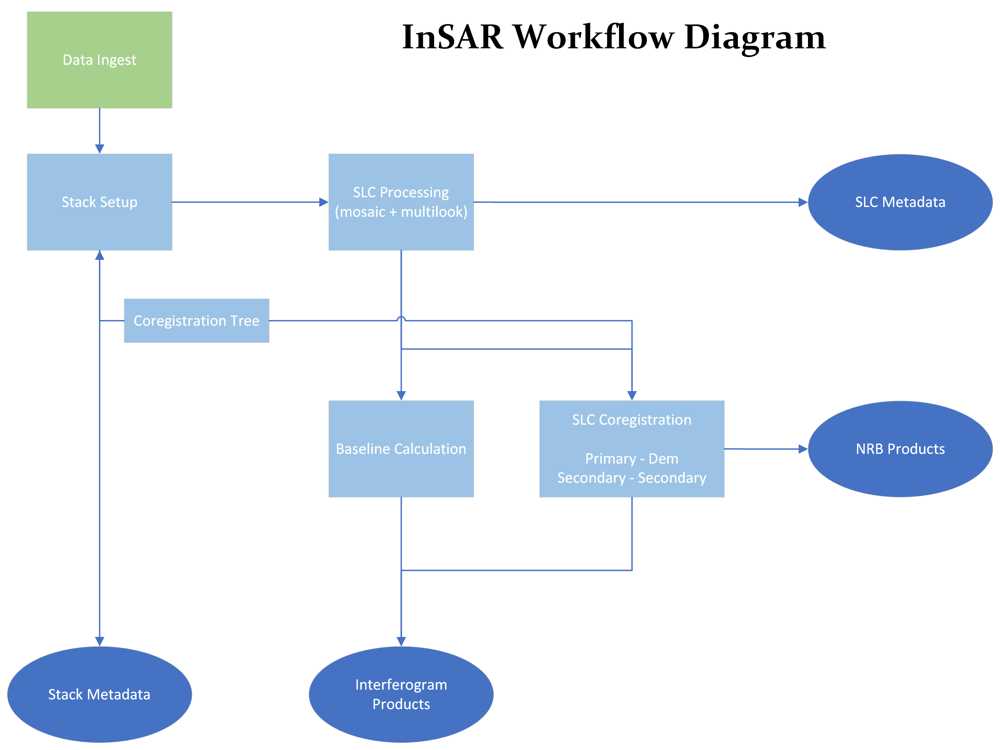

While processing, a `gamma_insar` stack ultimately takes in satellite acquisition data, and pushes it through a sequence of processing steps that produce two main output products: the NRB (normalised radar backscatter) and interferograms.

This document covers the stack processing workflow, detailing how data is passed through various processing steps and what those steps involve.

It's recommended the reader has already gone over `Stack.md` to understand some of the terms used in this document.

## Data Ingest ##

The very first thing stack processing needs to do is understand what data is being processed.
This step involves acquiring metadata on all the input satellite data for scenes of interest, to determine what their geospatial extents are, what dates the scenes cover, what polarisations their data contains, orbital vectors, etc...

Once completed, the stack is aware of all the input data to be processed and has some of it's high level properties.

## Stack setup ##

Before the stack can begin processing, it has to do a few initial tasks - this process is simply called the "stack setup" process.

The stack will "download" (or copy if the data is local) all the relevant input data into it's raw data directory (this is a temporary directory that is removed once processing is completed), identifying (and logging) any missing or corrupt data and removing them from stack processing.

After all the data is available to be processed the stack's scene extents are compared to the stack extent, which identifies area of missing spatial coverage / scenes that have incomplete data coverage - these scenes are also logged and removed from stack processing.

Lastly, once the final set of valid scenes are ready to process - the stack writes it's finalised metadata and is considered ready for processing.
This metadata is immutable (except for the appending of new dates), thus once this stage has passed the stack can not change any of it's properties.

## SLC processing ##

Due to the fact `gamma_insar` supports multiple sensors, and different sensors provide different data products capable of producing SLC - we need to normalise the satellite data products into a common product for our workflow, we call this the SLC processing step.

During this step, all the satellite specific products for each scene date are processed by GAMMA into a single SLC product for each date that covers the whole scene (this means satellites which have multiple swaths or subswaths/bursts, which cover the scene extent, are mosaiced together).

Once all SLC products have been produced for all scenes, an appropriate multi-looking subsampling is applied to the data (the multi-looking factors may be user specified or determined automatically depending on .proc settings).

If any SLC product in this stage fails to process, that scene date will be removed from the stack completely - however the stack processing will not be impacted and will continue processing without it.  This scenario is very rare and shouldn't never happen (which is the justification of the non-failure state of this scenario), however in the worst case if it does occur and losing this date is a signfiicant problem the scene can be appended back onto the stack once the error has been resolved at a later date.

## Primary SLC <-> DEM coregistration ##

The first step in the `gamma_insar` geocoding process is to coregister a single scene (the stack's primary/reference scene) to the stack's DEM.

The primary date is aligned to the DEM by cross-correlating the radar intensity values of the primary scene to that of simulated SAR generated from the DEM.  This alignment process will attempt to start from the scene land center location, however if this fails a search pattern around that land center may be used to avoid failures due to scene specific details (eg: maybe the scene center is a flat dessert with no significant features to align).

If this stage fails, the whole stack processing workflow will halt - as the products from this task are essential to the whole workflow.

## Secondary SLC coregistration ##

After the primary scene has been coregistered to the DEM, all other scenes (known as the secondary scenes) are then coregistered.

Coregistration between scenes is done in a hierarchial manner where by secondary scenes close to the primary scene will coregister directly with the primary scene, however as the temporal distance from the primary scene increases secondary scenes will instead coregister to a scene which is a bit closer to them than the primary scene.  The choice of tertiary scene chosen is common among all secondary scenes within `N` days of that tertiary date (as an example all scenes `N+1` to `N*2` days of the primary reference date share the same tertiary date) - in a sense this rpoduces a hierarchy/tree of coregistration dates that branches out from the primary reference scene as the temporal baseline grows in duration.

This coregistration tree is stored in the stack's `lists` directory and like most stack state can not be modified, however in the case of the coreg tree it can be appended to.

If this task fails for any scene, the workflow will continue processing all other scenes however any products related to the failed date will not be produced.  Once the user has rectified the processing errors the scenes may be completed at a later date by resuming the stack processing.

## Backscatter processing ##

Once we have well coregistered SLC, we can produce the NRB products from this data.

Without going into too much detail (which varies by sensor), the NRB product is essentially the multi-looked intensity values, corrected for gain/antenna/speckle/etc patterns which may occur in the original satellite data & then further corrected for terrain related artifacts.

In the case of NRT (near real-time) processing, NRB is produced directly from multi-looked SLC w/o any coregistration inbetween.

If this task fails for any scene, the workflow will continue processing even without the failed scenes NRB product.  Once the user has rectified the processing errors, the scenes may have their NRB produced at a later date by resuming the stack processing.

## IFG baseline computation ##

Before we can produce interferograms, the workflow needs to identify the best pairs of scenes to produce interferograms between (called the baselines).

`gamma_insar` uses the SBAS (shortest baseline subset) algorithm for producing interferogram baselines to reduce the geospatial+temporal differences between scenes used in interferograms.  These baselines are chosen to give us the best chance of achieving good quality coherence.

In the case where new dates are being appended to an existing stack, a new baseline set is produced using `N` of the latest dates from the previous stack baseline and all of the new dates - this ensures there are links from the new dates to the already processed dates in the stack.

## Interferogram processing ##

After we have decided on the baselines, interferogram processing can finally happen on the coregistered scenes.  This process will produce products which are all unwrapped from the same pixel & geocoded as closely to one another as possible - we also produce a few intermediate interferogram products which are described in the stack structure documentation.

Successful completion of interferogram processing is the end of the workflow.  If the stack's products have all successfully been processed the stack will be considered complete (but may still have dates appended to it), if there were errors in any of the product processing then the stack may have these errors rectified and then be resumed to complete the stack by successfully producing these products at a later date.

It is worth noting that there is a common GAMMA error in the `mcf` program where the phase unwrapping problem is too complex and the program fails.  As with all stack products, failures are logged and can easily be identified (see: `Logging.md` for details) - however this particular error can't easily be fixed by the user (in many cases the problem simply hits artificial intermal limits despite the scene being completely normal).

If this task fails for any baseline, the workflow will continue to process without failure - however the interferogram products for failed baselines will be missing.  Once the user has rectified the processing errors, the scenes may have their IFG products produced by resuming the stack processing.

## Intermediate product cleanup ##

To help with production scenarios where storage constraints may be an issue for large stacks, a final post-processing cleanup stage may be opted into.

The cleanup stage ultimately removes all intermediate files that may be useful to some users but are not actually the main end products of interest.  The files that will remain after this cleanup stage are:

1. All of the stack metadata and list structures
2. The Primary <-> DEM related files (eg: LUT, layover/shadow map, offset model, etc)
3. The multilooked/coregistered SLC data for all products
4. The NRB .tif files
5. The flat intergerogram data
7. All interferogram .tif and .par files
