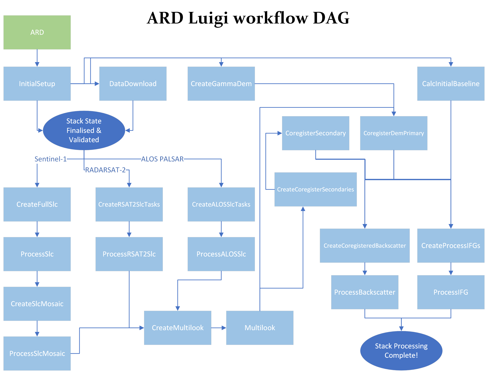

This document explains the technical structure of the Luigi workflow/DAG to introduce developers to how the workflow is engineered, how data flows from task to task, and why certain design decisions have been made, what tasks correlate to what products & processing modules, quirks and obscure details that are of note to people working on the workflow, etc.

## Products and Dependencies ##

The main outputs of the `gamma_insar` workflow are the NRB and IFG products, however producing these requires a lot of intermediate processing steps and products before they can be produced, which are explained briefly below (to help with the reader's understanding of some of the Luigi tasks used in the workflow in later sections).

| Product | Description |
| --- | --- |
| Satellite data acquisitions | To create a stack, we need satellite data to process - these data acquisitions are the input to our data processing. |
| Stack directory and/or .proc file | While not strictly a "product", it's a key input into the dependency chain upon which everything depends.  There is no stack processing without a well defined stack. |
| Mosaiced SLC scenes | `gamma_insar` normalizes all input SLC data into the concept of a "scene" which covers the whole region of the stack's extent... for many satellites which won't exactly match acquisition patterns to the user's stack frame extents, this involves mosaicing multiple acquistions together into a single product. |
| Multi-looked SLC scenes | `gamma_insar` usage typically doesn't involve producing products at full resolution, instead they're downsampled by a factor of 2 which is referred to as the "multi-look" factor - multi-looked products are differentiated from full-resolution SLC data with the `.mli` extension instead of `.slc` |
| DEM | In addition to SLC data from a SAR satellite, `gamma_insar` also requires a digital elevation model (DEM) to coregister to the stack's primary scene.  The provided DEM can be of any size (even the size of a whole continent or even a planet), `gamma_insar` will extract an appropriate region of interest out of it to keep memory usage low. |
| Coregistration tree | To decide what secondary scenes are coregistered to one another, we build a kind of hierarchial "tree" structure that ensures scenes are all coregistered to scenes within 2 months of each other - this tree structure is serialised to the disk as a set of files in the `lists` dir along with other scene manifests. |
| IFG baselines | In addition to a coregistration tree that determines how SLC data is correlated, we also produce "baselines" (pairs of scenes) for which we produce interferograms - these are distinct from the coregistration pairs in that the IFG baselines use the "Small BAseline Subset" (SBAS) algorithm  |
| Coregistered SLC scenes | Once the coregistration tree has been finalised, all of the scenes are coregistered to once another allowing them to be resampled accurately to one another - these products are stored as their own distinct files with the `r` prefix to denote they have been re-sampled from the original source data. |
| NRB | From the coregistered SLC scenes, normalised radar backscatter (NRB) is produced - this product is essentially an intensity image of the radio signal scattered back to the satellite (corrected for terrain/overshadowing/etc artifacts) |
| IFG | From the coregistered SLC scenes, using the baselines identified, interferometry products produced which are then processed by up-stream software packages like PyRate which allows the interferometry phase images to be converted into accurate depth images / topography. |

## Design Requirements ##

An important aspect to the design of the Luigi workflow is the fact we have some production requirements that aren't quite suited to how Luigi is typically used, these requirements are:
1. End product (coregistration, NRB & IFG) processing failures should NOT result in workflow failures, the stack should continue processing even if these products fail for one or more scenes.  The end result in a product failure should be a partially completed stack where interferograms have been produced for all scenes that succeeded, and products missing for those that failed - but the Luigi workflow should soldier on to the end regardless without error.
2. Product failures should be able to be recovered from by re-processing those scenes (leaving the already successfully processed scenes alone), this combined with requirement #1 implies Luigi task success does NOT correlate to product success...
3. Stack processing should be able to recover from unexpected failures (eg: Luigi being completely killed/interrupted before finishing), this is an implicit feature of Luigi when used normally but needs consideration due to quirks from us obeying requirements #1 & #2 above.
4. The set of products that make up a stack can expand (eg: new products can be added by extending the end-date of a stack), thus a complete stack can be made incomplete by expanding the end date.

## Luigi Tasks ##

Below is a manifest of all the Luigi tasks in the workflow, with information on where data flows from, flows to, and a short description.  These are very roughly in the order they execute, but for a better understanding of the data flow refer to the data flow diagram in the next section.

| Task Name | Flows To | Description |
| --------- | -------- | --- |
| `ARD` | `InitialSetup` | Starts off the stack setup process & directs the DAG toward the right workflow pipeline depending on parameters given (eg: normal  vs. resume vs. append) |
| `InitialSetup`| `DataDownload`, `CreateFullSlc` / `CreateRSAT2SlcTasks` / `CreateALOSSlcTasks`, `CalcInitialBaseline` | Finalises the stack setup process ensuring the stack is in a valid and complete state ready to begin processing. |
| `DataDownload` | | Downloads/copies satellite data acquisitions for a specified date and extract the data from them ready for processing (if they're bundled as an archive) |
| `CreateFullSlc` | `ProcessSlc`, `CreateSlcMosaic` | Creates the SLC processing tasks for the stack's scene list with S1 data |
| `ProcessSlc` | | Processes Sentinel-1 acquisition data into SLC scenes |
| `CreateSlcMosaic` | `CreateMultilook`, `ProcessSlcMosaic` | Creates the SLC mosaicing tasks for the SLC scenes |
| `ProcessSlcMosaic` | | Mosaics bursts and subswaths together into a single SLC scene for the acquisition's date |
| `CreateRSAT2SlcTasks` | `ProcessRSAT2Slc`, `CreateMultilook` | Creates the SLC processing tasks for the stack's scene list with RS2 data |
| `ProcessRSAT2Slc` | | Processes RADARSAT-2 acquisition data into SLC scenes |
| `CreateALOSSlcTasks` | `ProcessALOSSlc`, `CreateMultilook` | Creates the SLC processing tasks for the stack's scene list with ALOS data |
| `ProcessALOSSlc` | | Processes ALOS PALSAR acquisition data into SLC scenes |
| `CreateMultilook` | `Multilook`, `CoregisterDemPrimary` & `CreateCoregisterSecondaries` | Creates the multi-looking DAG for the stack's scene list |
| `Multilook` | | Downsamples SLC scenes by the specified multi-look factors. |
| `CreateGammaDem` | `CoregisterDemPrimary` | Extracts the stack's spatial extent out of the provided reference DEM file for the stack to use. |
| `CalcInitialBaseline` | `CoregisterDemPrimary` | Calculates the interferogram baselines (scene pairs used to produce interferometry for) |
| `CoregisterDemPrimary` | | Coregister's the scene's primary scene to the DEM |
| `CreateCoregisterSecondaries` | `CoregisterSecondary`, `CreateCoregisteredBackscatter`, `CreateProcessIFGs` | Creates coregistration tasks for the stack's secondary scenes |
| `CoregisterSecondary` | | Coregisters one scene in the stack to another scene |
| `CreateCoregisteredBackscatter` | `ProcessBackscatter` | Creates the backscatter processing tasks for the stack's scene list |
| `ProcessBackscatter` | | Processes the normalised radar backscatter (NRB) for a specified stack scene |
| `CreateProcessIFGs` | `ProcessIFG` | Creates the interferogram processing tasks for the stack's baseline set. |
| `ProcessIFG` | | Processes the interferometry for a specified scene date (between that date and it's allocated baseline pair) |

Note: All of the `Create*` tasks are conceptually similar, due to the fact our DAG isn't final until after `InitialSetup` has completed (as data for a date could be invalid/corrupt/gone-missing/etc) we have to dynamically define parts of the DAG for each scene in the stack, which is what these tasks do.

## Data Flow Diagram ##

To help developers better visualise the data flow, a visual diagram has been made to help visualise the flow.

## Stack Setup ##

The stack setup process is split across two tasks currently due to the nature of the ARD pipeline (which can work in different ways depending on parameters provided).  The first part of the setup is managed by the `ARD` task, while the bulk of the work is undertaken by the `InitialSetup` task located in `insar/workflow/luigi/stack_setup.py`.

The `ARD` task essentially starts to "finalise" the .proc file, which means loading it, overriding any task-parameters that were provided to the task (these are often provided by the user as command line arguments), and validating that the proc file is valid (eg: if a stack already exists, that the .proc file is consistent with the existing stack / obeys resume or append logic).

The `InitialSetup` task is responsible for setting up a stack and determining 'what' needs to be processed (as the set of products isn't well-defined until after the stack and datasets are loaded).  This task is one of the more important tasks in the workflow in the sense that it defines 'what' is processed, as it resolves include/exclude date periods into a set of data acquisitions from the geospatial/temporal database, downloads/determines if acquisitions are valid or invalid/corrupt (removing them from the stack).

Once the `InitialSetup` stack has completed finalising/validating the .proc file, it will generate the stack `lists` manifest files, as well as the stack metadata JSON.  All of this ensures the stack definition is completely valid and ready for processing (or resuming), with a well-defined set of acquisitions/scenes to process.

In simple terms, `InitialSetup` satisfies that the "what" needs to be processed is well-defined, the "how" it's being processed is valid, and the state of the stack is valid and ready to go.

## Product Errors vs. Task Errors ##

Due to the design requirement that product failures should not result in workflow/task failures, there's no way to determine with Luigi alone if a product is complete or failed (which is unfortunate, as that's a big part of what Luigi typically does for workflows).  Instead task failures really only represent truly catastrophic failures (logic/programming errors such as raise exceptions will result in task failures, but product failures will not).

This is implemented by putting all product processing code in try/except scope to catch and suppress errors into logged errors, and instead of having the products as the output files of the task (which could exist even if the processing failed) the output file of all tasks are instead a kind of "status" text file which holds a failure message if it failed, or is an empty file if it succeeded (and the products should exist and be valid).

## Stack Resuming ##

Due to the technical implications of our product vs. task error design, we can't rely on Luigi's process for re-running or resuming a workflow pipeline, and instead we have had to implement our own resume logic as a distinct pipeline task called `TriggerResume`.

The `TriggerResume` task kicks off an alternative workflow pipeline where *scenes* are processed individually from SLC to end products, instead of the normal workflow which batch processes *products*.  The resume task identifies the completeness of all scenes, and triggers the appropriate processing tasks for all missing products for all scenes which miss any kind of product via the `ReprocessSingleSLC` task.

Due to the dynamic/runtime determination of completeness of scenes, the `ReprocessSingleSLC` task uses dynamic dependencies in it's `run()` function which dispatches processing tasks for the earliest missing product (and all those that are derived from it).  This is one of the few cases dynamic dependencies are used, and a cause of warnings in the Luigi workflow logs about changing dependencies (which comes with their use).

## Stack Appending ##

While most stack states/settings are immutable, one thing that can change is the end-date of a stack - which is typically referred to as "appending" to the stack.  This allows an already processed stack to grow into the future as new data becomes available.

This is achieved with the `AppendDatesToStack` task, starts off similar to the `InitialSetup` task will load and finalise the .proc file but with special logic that allows for the extension of the stack's end date, but then immediately produces extra coregistration tree levels for the new scenes, and a **new** SBAS network (which shares some baseline dates with the tail end of the last SBAS network to ensure it can be linked with the existing stack scenes).  Once the stack state is valid and finalised, it continues processing the new dates with it's own processing pipeline similar-ish to the resume pipeline based on `ReprocessSingleSLC` and directly dispatching `CoregisterSecondary` / `ProcessBackscatter` / `ProcessIFG`.

## Satellite Specific Tasks ##

While most of the `gamma_insar` code base and workflow is satellite-agnostic, there are differences in how Sentinel-1 scenes are coregistered vs. other sensors, and inevitably each sensor has it's own satellite-specific SLC scene processing code.  This means at the workflow level there are also satellite-specific code paths and tasks.

The key difference between Sentinel-1 and the other satellites is the fact S1 acquisitions come in smaller bursts which need to be mosaiced together and coregistered together using additional/extra processes, where as other satellites typically provide a single consistent acquisition frame that's already processed to the level we need in `gamma_insar`.

Because of this, Sentinel-1 has the additional `CreateSlcMosaic` task which runs the mosaicing process, and has it's own dedicated coregistration processing modules used by the `CoregisterSecondary` task (which will dispatch to the S1-specific code when given S1 data).

Additionally all satellites currently have their own SLC scene processing tasks, which for completeness are listed:
 * Sentinel-1 uses `CreateFullSlc` -> `ProcessSlc` (they will eventually be renamed to be consistent to other task names)
 * ALOS PALSAR uses `CreateALOSSlcTasks` -> `ProcessALOSSlc`
 * RADARSAT-2 uses `CreateRSAT2SlcTasks` -> `ProcessRSAT2Slc`

The satellite specific `Create*` tasks are a known code smell, they're largely identical code that shouldn't be repeated - these will eventually be condensed down into a single task.

The requirement of different satellite-specific tasks is made by `CreateMultilook` which is ultimately what requires the SLC scenes, thus depends on the satellite specific SLC creation tasks - this is done dynamically in it's `requires` function based on the .proc `SENSOR` setting (as multi-satellite stacks are not currently supported).  In addition to this, the `ReprocessSingleSLC` used by resume and append workflows also depends on these satellite specific tasks and also dynamically dispatches these tasks in a similar fashion.
